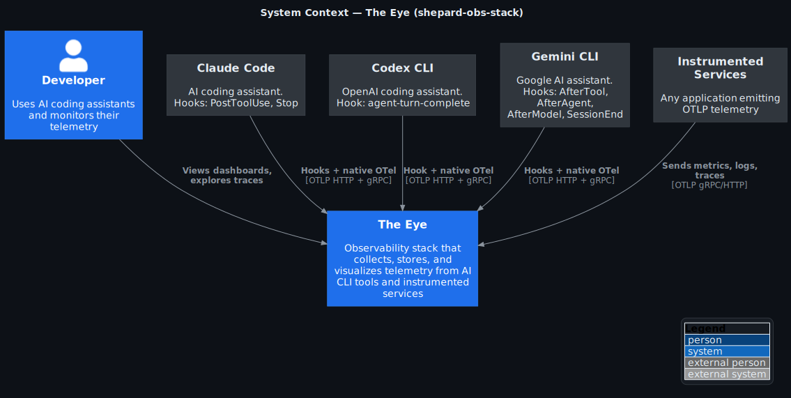
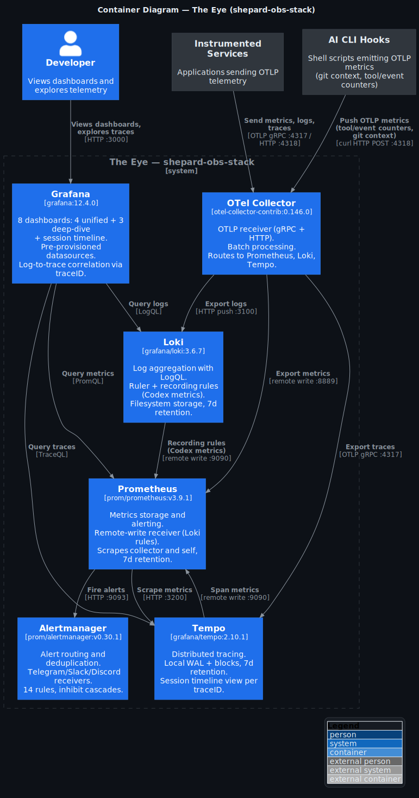

# shepard-obs-stack

[](https://grafana.com/)
[](https://prometheus.io/)
[](https://grafana.com/oss/loki/)
[](https://opentelemetry.io/docs/collector/)
[](LICENSE)

**The Eye** — self-hosted observability for AI coding assistants.

You use Claude Code, Codex, or Gemini CLI every day. 
You have no idea how much they cost, which tools they call, or whether they're actually helping. 
This fixes that.

## Highlights

- **One command** to start: `./scripts/init.sh` — 6 services, 8 dashboards, under a minute
- **Three CLIs supported**: Claude Code, Codex, Gemini CLI — hooks + native OpenTelemetry
- **Eight Grafana dashboards** auto-provisioned: cost, tools, operations, quality, per-provider deep dives, and session timeline
- **Minimal dependencies** — Docker, plus `bash`, `curl`, and `jq` on the host for hooks and tests. No Python, no Node, no cloud accounts
- **Works offline** — everything runs on localhost, your data stays on your machine

## Quick Start

**Prerequisites:** Docker (with Compose v2), `curl`, `jq`, and at least one AI CLI installed.

```bash
git clone https://github.com/shepard-system/shepard-obs-stack.git
cd shepard-obs-stack
./scripts/init.sh          # starts stack + health check
./hooks/install.sh         # injects hooks into your CLI configs
```

Open [localhost:3000](http://localhost:3000) (admin / shepherd). Use your CLI as usual — data appears in dashboards within seconds.

```bash
./scripts/test-signal.sh   # verify the full pipeline (11 checks)
```

## Dashboards

### Unified (cross-provider)

| Dashboard      | Question it answers                     |
|----------------|-----------------------------------------|
| **Cost**       | How much is this costing me?            |
| **Tools**      | Who is performing and who is wandering? |
| **Operations** | What is happening right now?            |
| **Quality**    | How well is the system working?         |

### Deep Dive (per-provider)

| Dashboard       | What you see                                            |
|-----------------|---------------------------------------------------------|
| **Claude Code** | Token usage, cost by model, tool decisions, active time |
| **Codex**       | Sessions, API latency percentiles, reasoning tokens     |
| **Gemini CLI**  | Token breakdown, latency heatmap, tool call routing     |

### Session Timeline

| Dashboard            | What you see                                                                               |
|----------------------|--------------------------------------------------------------------------------------------|
| **Session Timeline** | Synthetic traces from all 3 CLI session logs — tool call waterfall, MCP timing, sub-agents |

Click any Trace ID to open the full waterfall in Grafana Explore → Tempo.

Dashboard template variables: **Tools** and **Operations** support `$source` and `$git_repo` filtering. 
**Deep Dive** dashboards use `$model`. **Session Timeline** uses `$provider`. **Cost** and **Quality** show aggregated data without filters.

## How It Works

AI CLIs emit telemetry through two channels:

```
AI CLI (Claude Code / Codex / Gemini)
    │
    ├── bash hooks → OTLP metrics (tool calls, events, git context)
    │                 └─→ OTel Collector :4318
    │
    └── native OTel → gRPC (tokens, cost, logs, traces)
                       └─→ OTel Collector :4317
                             │
                             ├── metrics → Prometheus :9090
                             ├── logs → Loki :3100
                             └── traces → Tempo :3200
                                           │
Loki recording rules ──── remote_write ───→ Prometheus
                                           │
Grafana :3000 ←── PromQL + LogQL ──────────┘
```

**Hooks** provide what native OTel cannot: git repo context and labeled tool/event counters. 
Everything else (tokens, cost, sessions) comes from native OTel export.

## Hook Setup

```bash
./hooks/install.sh              # all detected CLIs
./hooks/install.sh claude       # specific CLI
./hooks/install.sh codex gemini # selective
./hooks/uninstall.sh            # clean removal
```

The installer auto-detects installed CLIs and merges hook configuration into their config files (creating backups first).

| CLI         | Hooks                                                 | Native OTel signals     |
|-------------|-------------------------------------------------------|-------------------------|
| Claude Code | `PostToolUse`, `Stop`                                 | metrics + logs          |
| Codex CLI   | `agent-turn-complete`                                 | logs                    |
| Gemini CLI  | `AfterTool`, `AfterAgent`, `AfterModel`, `SessionEnd` | metrics + logs + traces |

## Alerting

Alertmanager runs on :9093 with alert rules for infrastructure, pipeline health, and service quality. 
Native Telegram and Slack receivers are included — uncomment and configure in `configs/alertmanager/alertmanager.yaml`:

```yaml
# telegram_configs:
#   - bot_token: 'YOUR_BOT_TOKEN'
#     chat_id: YOUR_CHAT_ID
#     send_resolved: true
```

## Services

| Service        | Port      | Purpose              |
|----------------|-----------|----------------------|
| Grafana        | 3000      | Dashboards & explore |
| Prometheus     | 9090      | Metrics & alerts     |
| Loki           | 3100      | Log aggregation      |
| Tempo          | 3200      | Distributed tracing  |
| Alertmanager   | 9093      | Alert routing        |
| OTel Collector | 4317/4318 | OTLP gRPC + HTTP     |

## Architecture

<details>
<summary>C4 diagrams (click to expand)</summary>

### System Context



### Containers



</details>

## Project Structure

```
shepard-obs-stack/
├── docker-compose.yaml
├── .env.example
├── hooks/
│   ├── lib/                   # shared: git context, OTLP metrics + traces, session parser
│   ├── claude/                # PostToolUse + Stop
│   ├── codex/                 # agent-turn-complete
│   ├── gemini/                # AfterTool + AfterAgent + AfterModel + SessionEnd
│   ├── install.sh             # auto-detect + inject
│   └── uninstall.sh           # clean removal
├── scripts/
│   ├── init.sh                # bootstrap
│   ├── test-signal.sh         # pipeline verification (11 checks)
│   └── render-c4.sh           # render PlantUML → SVG
├── configs/
│   ├── otel-collector/        # receivers → processors → exporters
│   ├── prometheus/             # scrape targets + alert rules
│   ├── alertmanager/           # routing, Telegram/Slack receivers
│   ├── loki/                   # storage + 15 recording rules
│   ├── tempo/                  # trace storage, 7d retention
│   └── grafana/                # provisioning + 8 dashboard JSONs
└── docs/c4/                    # architecture diagrams
```

## Contributing

Issues and pull requests are welcome. Before submitting changes, run the test pipeline:

```bash
./scripts/test-signal.sh    # should pass 3/11 checks (others need live CLI data)
```

## License

[Elastic License 2.0](LICENSE) — free to use, modify, and distribute. Cannot be offered as a hosted or managed service.

Part of the [Shepard System](https://github.com/shepard-system).
